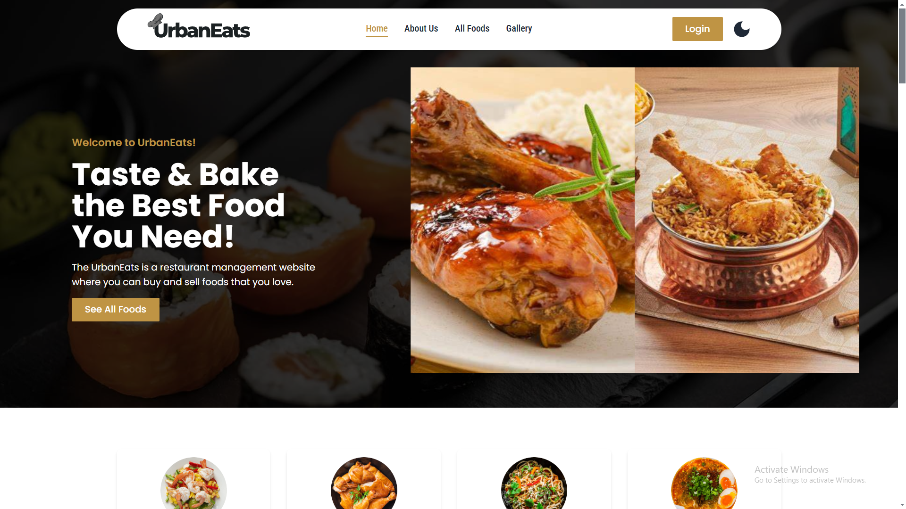

# UrbanEats(Restaurant Management App)

UrbanEats is a multilevel Restaurant store management web application where users can purchase their necessary delicious foods and also users can sell their prepared foods. users can add orders and update their foods via this application. Also, The design is unique and attention to detail was implemented. Users can see the top foods and available foods and based on this they can take their decision.


### key Features:

- 🚀 **User-Friendly UI:** A visually appealing responsive interface with a stunning navbar and footer. The UI has two variants, dark and light.
- 🔐 **Authentication & Security:** Firebase authentication and JWT token verification implemented
- 🛍 **Buy & Sell:** Users can purchase and list their own food for sale
- 🔄 **Manage Listings:** Users can add, update, and delete their food products
- 📸 **Gallery Feature:** An interactive gallery for managing added foods
- 🔒 **Data Protection:** Secure database handling with MongoDB
- 🔒 **Data Protection:** Secure database handling with MongoDB

### Technologies used

- **Frontend:** React, React Router, React Icons, Swiper
- **Backend & Database:** Firebase, MongoDB
- **Authentication & Security:** Firebase Authentication, JWT
- **Others:** Axios, Moment.js, React-Toastify, Yet-Another-React-Lightbox

## Dependencies Used

```json
"dependencies": {
  "axios": "^1.7.9",
  "firebase": "^11.1.0",
  "moment": "^2.30.1",
  "react": "^18.3.1",
  "react-dom": "^18.3.1",
  "react-icons": "^5.4.0",
  "react-router-dom": "^7.1.0",
  "react-toastify": "^11.0.2",
  "swiper": "^11.1.15",
  "yet-another-react-lightbox": "^3.21.7"
}
```

## How to Run Locally

1. Clone the repository:
   ```bash
   git clone https://github.com/yourusername/urbaneats.git
   cd urbaneats
   ```
2. Install Dependencies:
   ```bash
   yarn
   ```
3. Create a .env file and add your Firebase & backend API keys

4. Start the development server:
   ```bash
   yarn start
   ```

## Links

Live Link: [Click Here!](https://urbaneats-72385.web.app/)
Serverside GitHub Repository: [click Here!](https://github.com/shihabhq/urbaneats-server)
